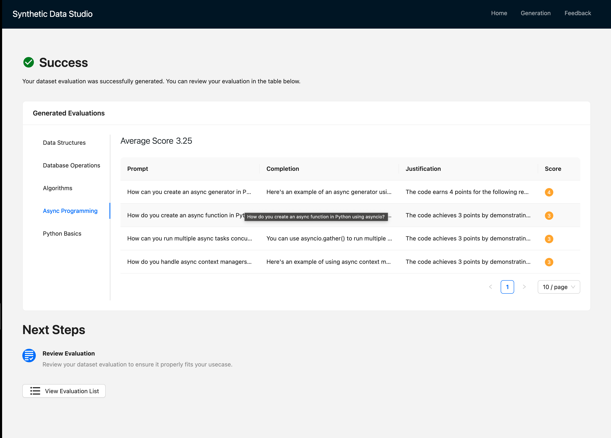
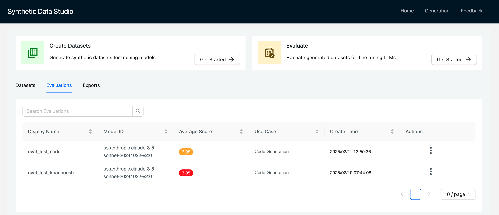

# Supervised Finetuning Workflow:

In this workflow we will see how we can evaluate synthetic data generated in previous steps using Large Language Model as a judge.

User can Trigger evaluation via List view where they can chose evaluation to begin from the dropdown.


## Evaluation Workflow

Similar to generation evaluation also allows users to specify following 

1. #### Display Name
2. #### Model Provider: AWS Bedrock or Cloudera AI Inference
3. #### Model ID: Calude , LLAMA , Mistral etc.

The code generation and text2sql are templates which allow users to select from already curated prompts,  and examples to evaluate datasets.

Custom template on the other hand allows users to define everything from scratch to evaluate created synthteic dataset from previous step.

The screen shot for the same can be seen below:


### Prompt and Model Parameters

#### Prompt:
This step allows user to curate their prompts manuallly, or chose from given templates or let LLM curate a prompt based on their description of use case.

```json
{
"""Below is a Python coding Question and Solution pair generated by an LLM. Evaluate its quality as a Senior Developer would, considering its suitability for professional use. Use the additive 5-point scoring system described below.

Points are accumulated based on the satisfaction of each criterion:
    1. Add 1 point if the code implements basic functionality and solves the core problem, even if it includes some minor issues or non-optimal approaches.
    2. Add another point if the implementation is generally correct but lacks refinement in style or fails to follow some best practices. It might use inconsistent naming conventions or have occasional inefficiencies.
    3. Award a third point if the code is appropriate for professional use and accurately implements the required functionality. It demonstrates good understanding of Python concepts and common patterns, though it may not be optimal. It resembles the work of a competent developer but may have room for improvement in efficiency or organization.
    4. Grant a fourth point if the code is highly efficient and follows Python best practices, exhibiting consistent style and appropriate documentation. It could be similar to the work of an experienced developer, offering robust error handling, proper type hints, and effective use of built-in features. The result is maintainable, well-structured, and valuable for production use.
    5. Bestow a fifth point if the code is outstanding, demonstrating mastery of Python and software engineering principles. It includes comprehensive error handling, efficient algorithms, proper testing considerations, and excellent documentation. The solution is scalable, performant, and shows attention to edge cases and security considerations."""
}
```


#### Model Parameters

We let user decide on following model Parameters:

- **Temperature**
- **TopK**
- **TopP**


### Examples:

In the next step user can specify examples they would want to give for their evaluation of  dataset so that LLM can follow same format and Judge/rate datasets accordingly.

The examples for evaluation would be like following:

The **scoring** and **Justification** can be defined by user within the prompt and example for example in this use case we use a 5 point rating system, user can make it **10 point ratings**, **Boolean** , **subjective ("bad", "Good", "Average")**  etc.

```json
{
  "score": 3,
                    "justification": """The code achieves 3 points by implementing core functionality correctly (1), 
                    showing generally correct implementation with proper syntax (2), 
                    and being suitable for professional use with good Python patterns and accurate functionality (3). 
                    While it demonstrates competent development practices, it lacks the robust error handling 
                    and type hints needed for point 4, and could benefit from better efficiency optimization and code organization."""
                },
                {
                    "score": 4,
                    "justification": """
                    The code earns 4 points by implementing basic functionality (1), showing correct implementation (2), 
                    being production-ready (3), and demonstrating high efficiency with Python best practices 
                    including proper error handling, type hints, and clear documentation (4). 
                    It exhibits experienced developer qualities with well-structured code and maintainable design, though 
                    it lacks the comprehensive testing and security considerations needed for a perfect score."""
}
```


### Final Output:

Finally user can see how their output looks like with corresponding Scores and Justifications.

The output will be saved in Project File System within Cloudera environment.



The output and corresponding metadata (scores,model etc.) can be seen on the **Evaluations** list view as well as shown in screen shot below.




