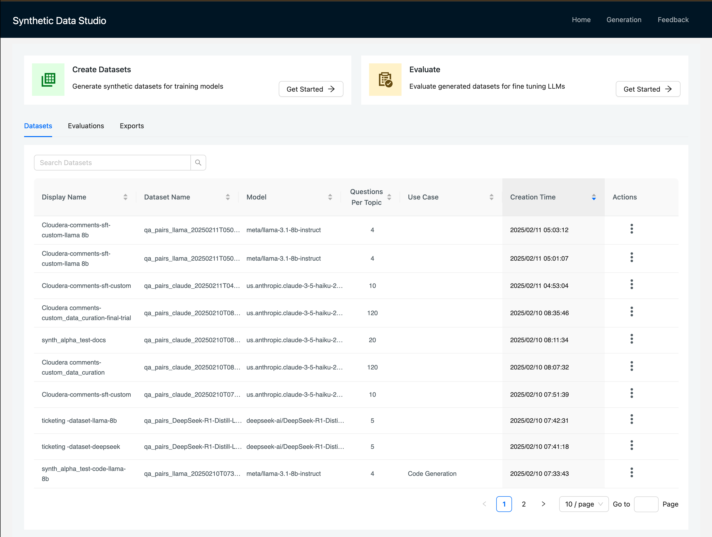
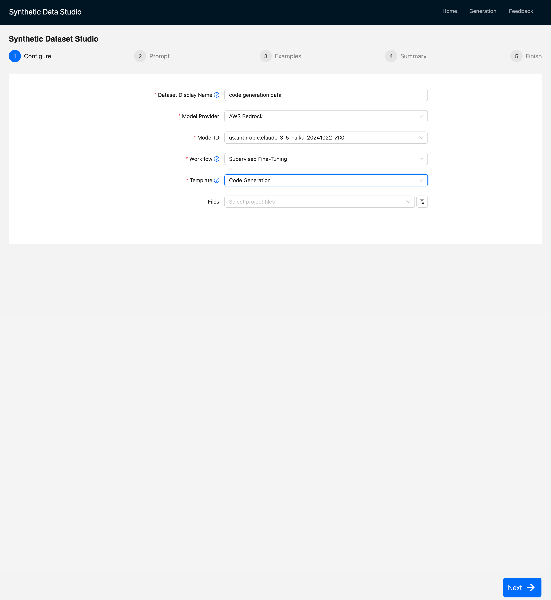
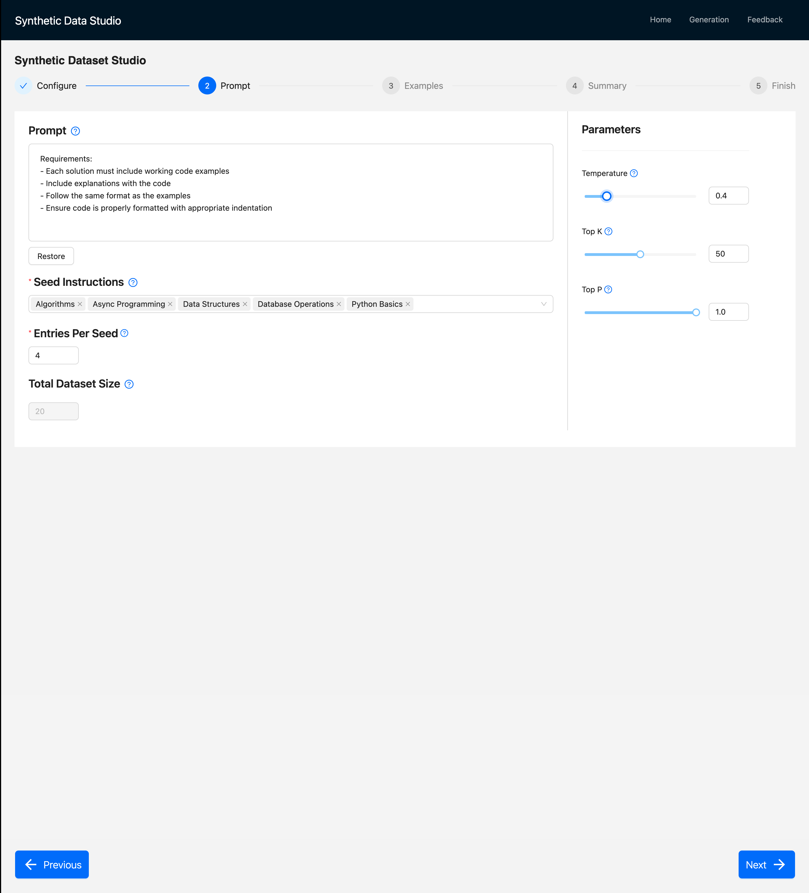
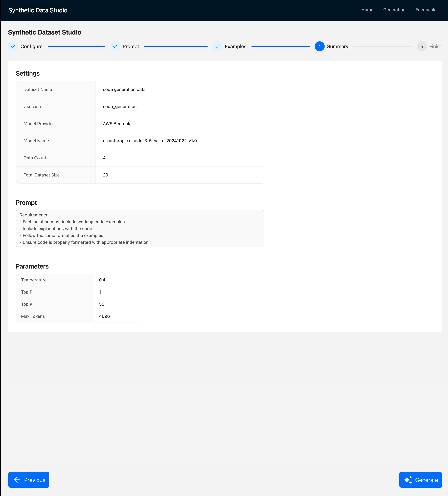
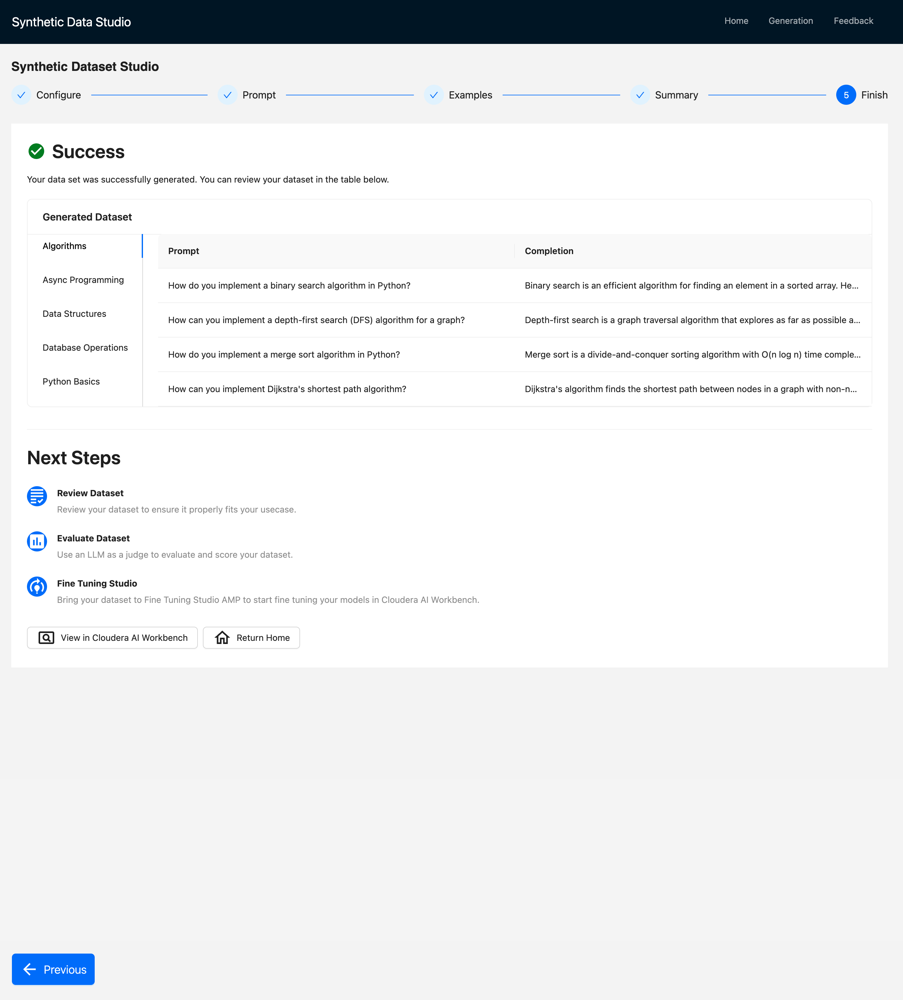

# Generation Workflow:

This workflow demonstrates how to create synthetic data for fine-tuning models. Users can choose from pre-defined templates or define their own.

## Templates

1. **Code Generation**
2. **Text to SQL**
3. **Custom**

The **Code Generation** and **Text-to-SQL** templates allow users to select from curated prompts, seeds (explained below), and examples to generate datasets.

The **Custom** template, on the other hand, enables users to define everything from scratch, allowing them to generate synthetic datasets tailored to their **enterprise use cases**.

## Workflow Example: Code Generation

### Home Page
On the **Home Page**, users can click on **"Create Dataset"** to get started.



### Generate Configuration: In the next step user gets to specify following fields:

#### **1. Display Name**
A user-defined name for the dataset.

#### **2. Model Provider**  
Choose from available providers such as **AWS Bedrock** or **Cloudera AI Inference**.

#### **3. Model ID**  
Select the target model: **Claude, LLaMA, Mistral**, etc.
#### **4. Workflow**  

##### **a. Supervised Fine-Tuning**  
Generate prompt-completion pairs with or without additional documents (**PDFs, DOCs, TXTs**, etc.).

##### **b. Custom Data Curation**  
Use a **JSON array** (uploaded by the user) to generate responses. This allows users to provide their own **inputs, instructions**, and obtain customized outputs for corresponding inputs.

#### **5. Files**  
Users can select **input files** from their project file system for the workflows mentioned above.



---

## Prompt and Model Parameters

### **Prompt**:
This step allows users to **curate prompts manually**, **select from predefined templates**, or **let the LLM generate a prompt** based on their use case description.

```json
{
"""Write a programming question-pair for the following topic:

Requirements:
- Each solution must include working code examples
- Include explanations with the code
- Follow the same format as the examples
- Ensure code is properly formatted with appropriate indentation"""
}
```

#### Seeds:

This helps LLM diversify dataset user wants to generate. We drew inspiration from **[Self Intruct Paper](https://huggingface.co/papers/2212.10560)**
 , where 175 hand crafted human seed instructions were used to diversify curation of dataset.

 For example, for code generation, seeds can be:
- **Algorithms for Operation Research**
- **Web Development with Flask**
- **PyTorch for Reinforcement Learning**

Similarly for language translation, seeds can be:
- **Poems**
- **Greetings in Formal Communication**
- **Haikus**

#### Model Parameters

We let user decide on following model Parameters:

- **Temperature**: 
- **TopK**
- **TopP**

#### Dataset Size: 
Users can specify how large the generated dataset should be.


### Examples:

In this step, users can provide **example question-answer pairs** to help the LLM maintain a consistent format while generating synthetic datasets.

For **code generation**, an example could be:

```json
{
   "question": "How do you read a CSV file into a pandas DataFrame?",
   "solution": """You can use pandas.read_csv(). Here's an example
   
        import pandas as pd
        df = pd.read_csv('data.csv')
        print(df.head())
        print(df.info())
"""
}
```


### Summary:

This allows user to finally look at prompt, seeds, dataset size and other parameters they have selected for data generation.



### Final Output:

Finally user can see how their output looks like with corresponding Prompts and Completions.

The output will be saved in Project File System within Cloudera environment.




The output and corresponding metadata (scores,model etc.) can be seen on the **Generations** list view as well as shown in screen shot below.
